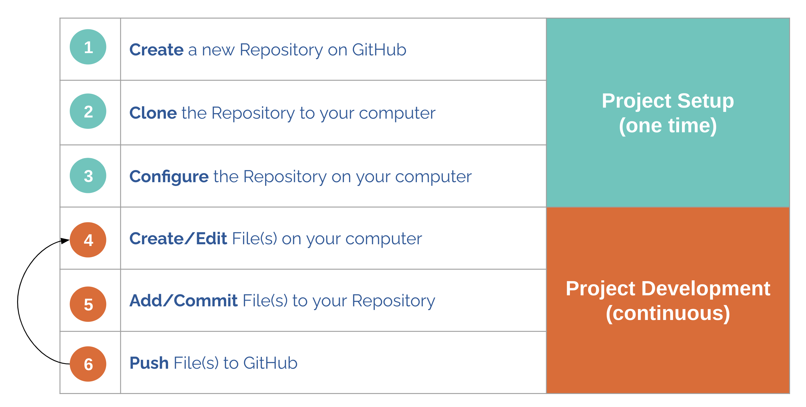
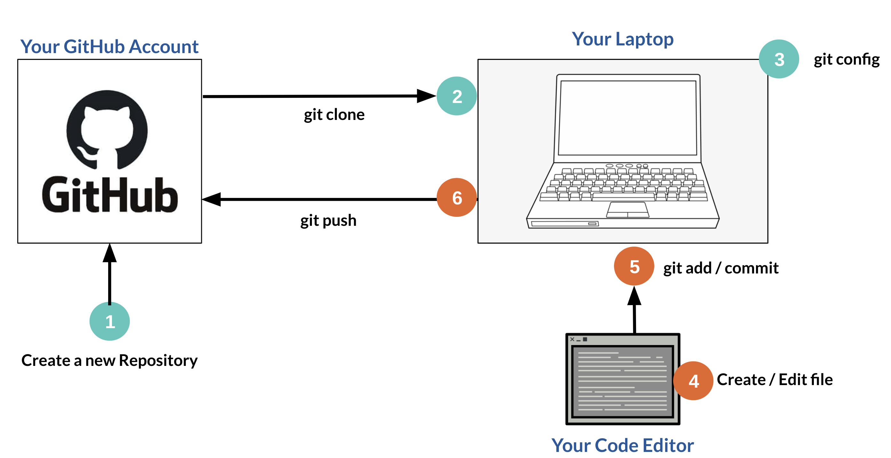
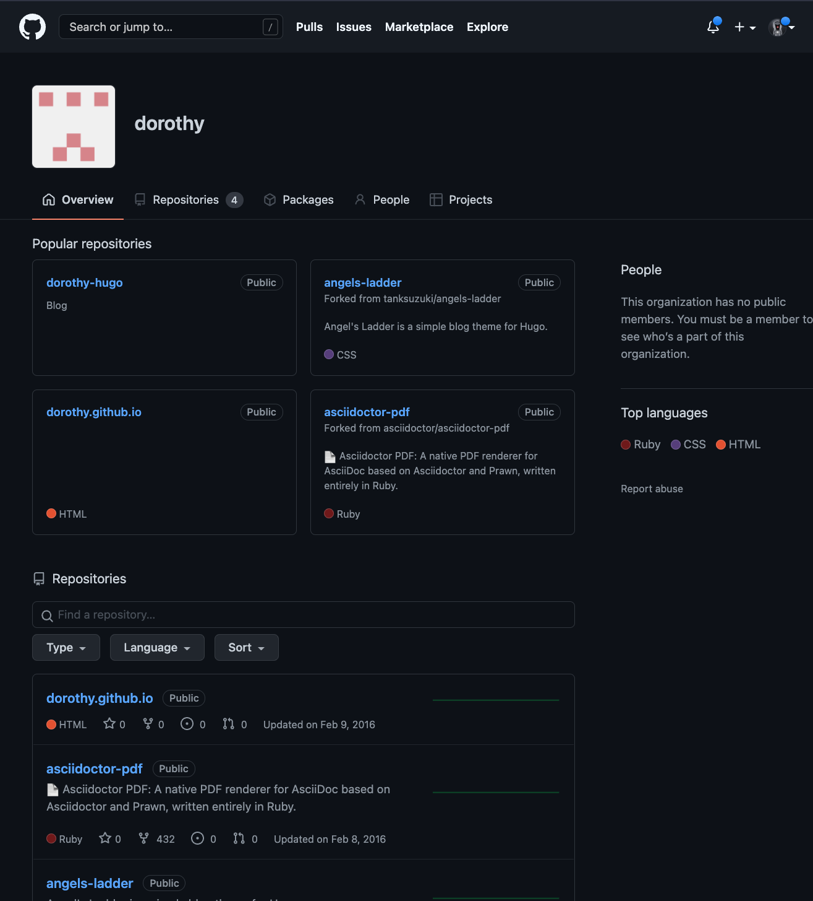
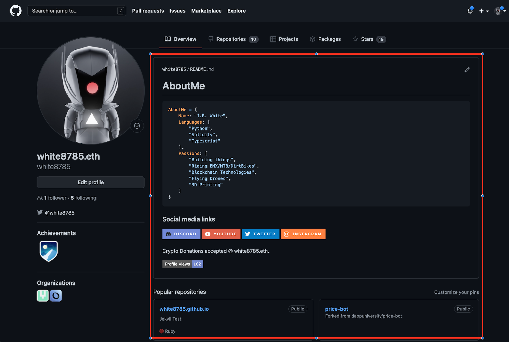
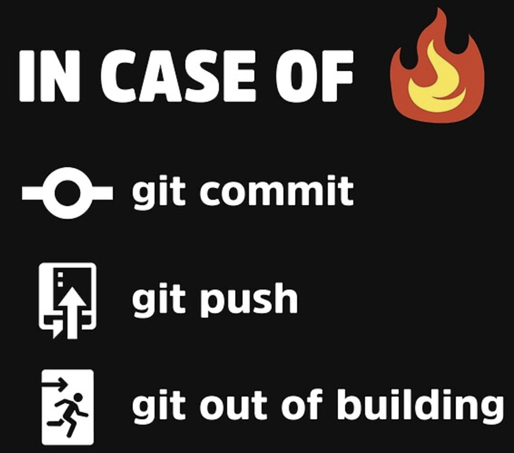

# Git & Github

## Contents
1. [Demo Overview](#demo-overview)
1. [Prerequisites](#prerequisites)
1. [Topic Overview](#topic-overview)
1. [References](#references)
1. [Demo](#demo)
1. [Next Steps](#next-steps)
1. [Homework](#homework)

## Demo Overview

The goal of this demo is to learn a basic git workflow using a personal repository on GitHub to save and share your project.

## Prerequisites

- computer with administrator access, 
- if you're on Windows you should have a bash shell installed. See https://itsfoss.com/install-bash-on-windows/ for various options.
- a GitHub.com account
- git installed on your computer

## Topic Overview

It helps to start with an understanding of the overall workflow before digging into the specific git commands.

A simple git workflow can be broken down into two main phases: Project Setup and Project Development. 

- In Project setup, you are creating a git repository and linking your computer to GitHub.

- In Project Development, you are creating/updating the files in your project and syncing them with GitHub.

The process starts by creating a repository on github.com. Then you need to link the GitHub repo to your machine by either git clone or git add origin. Then you can work on the files in your repository on your local machine and sync them to git with git push.

In the next sections, we'll go through the commands in detail.

## References

### Common Git Commands

What changes exist, and what is the state of git?
- Status: `git status`

Pull code down from a configured Git. Rebasing is helpful just prior to Pull Request submission as it pulls the remote changes and re-applies your changes on top for a clean commit tree.
- Pulling: `git pull`
- Pulling and rebase: `git pull --rebase`

Changes look good, add changes to the index
- Adding: `git add` .

All index changes look good, wrap into commit and stage the commit
- Committing: `git commit -m “message”`

Push the staged commit to the configured branch upstream repo
- Pushing: `git push`

See detailed file changes
- Diffing: `git diff`

## Demo

### Mentor Demo 1

1. Install git: https://git-scm.com/downloads
(optional) GitHub command-line tool: https://cli.github.com/
1. Setup GitHub account via: https://github.com/join
1. Create a new repository with the same name as your username using default options
1. Generate a private key pair: https://docs.github.com/en/authentication/connecting-to-github-with-ssh/generating-a-new-ssh-key-and-adding-it-to-the-ssh-agent
1. Add private key to GitHub account: https://docs.github.com/en/authentication/connecting-to-github-with-ssh/adding-a-new-ssh-key-to-your-github-account
1. Test SSH connection using private key: https://docs.github.com/en/authentication/connecting-to-github-with-ssh/testing-your-ssh-connection
1. Initialize the repository in a local workspace

`

    # create a workspace directory where all future projects will share
    cd ~
    mkdir workspace
    cd workspace

    # create a directory for the repo
    mkdir $<myreponame>
    cd $<myreponame>

    # initialize the directory with git
    git init

    # create the README file and add some contents
    echo "my-special-repo" >> README.md

    # add the modified file to the git index
    git add README.md

    # wrap index files into a commit
    git commit -m "Initializing my profile repo"

    # move to the main branch aka create
    git branch -M main

    # tell git where the remote repo lives
    # substitute username and reponame values before executing
    git remote add origin git@github.com:username/reponame.git

    # tell the git branch where its upstream repo lives
    git branch --set-upstream-to=origin/main main

    # push your changes from your local machine's staging area to the remote repository GitHub.com
    # to the main branch
    git push

`

### Student Execrise 1
1. Create a repsoitory on Github called LouisvilleRiverFrogs. 
1. Sync the repository to your local machine. 
1. Add some text to a README.md file in your repository.
1. Push your changes to Github

### Mentor Demo 2
Let's give your GitHub account profile some style.

Now that you know how to modify files locally, and push them to a remote repo at GitHub you deserve to flex a bit. In this section, we are going to take advantage of a special kind of repo on GitHub called a profile repo that tells GitHub to display the **README.md** of the repo as a user profile object on the GitHub account profile page. Not sure what I'm talking about? Here are some pics:

Standard GitHub profile look. No hate Dorothy, you were completely random.

One example of customization. Everything inside of the red box is read directly from the README.md that exists in the root of our repo that we just created.

Below is the snippet of code used in the customized example. See if you can update your README.md with some sort of personalization. GL!

`
     AboutMe

    python
    AboutMe = {
        Name: "Name",
        Languages: [
            "Python",
            "Solidity",
            "Typescript"
        ],
        Passions: [
            "Building things",
            "Blockchain Technologies",
        ]
    }

    ### Social media links

     
    
     
    
     
    
    

    Crypto Donations accepted @ MyENSName.

    
    If you've made it this far successfully, you are on your way to good things. Give me 

`

### Student Exercise 2
1. update your GitHub profile with some details about you

## Next Steps

In this week's course, we learned...

1. How to create a GitHub account
1. How to create a private SSH key that will keep our connection secure
1. How to add that private SSH key to our GitHub account for access
1. How to initiate an existing GitHub repo via the command-line
1. How to push a file to GitHub
1. How to pimp out our GitHub account profile
1. This process and the experience gained from using git can benefit you in various ways and will be used in every position you run across. Practice, and get familiar. You will be here a lot during your career.

If nothing else, using git could save you from losing your work.

### Homework

Set up your own repo for your Code Louisville project. 