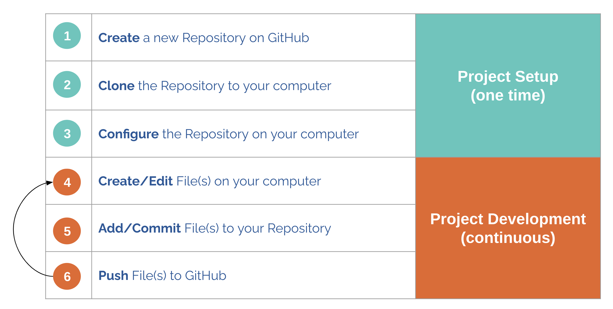
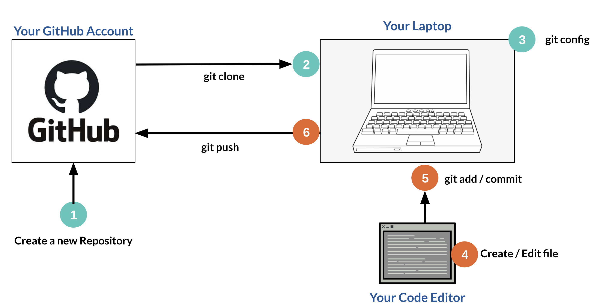
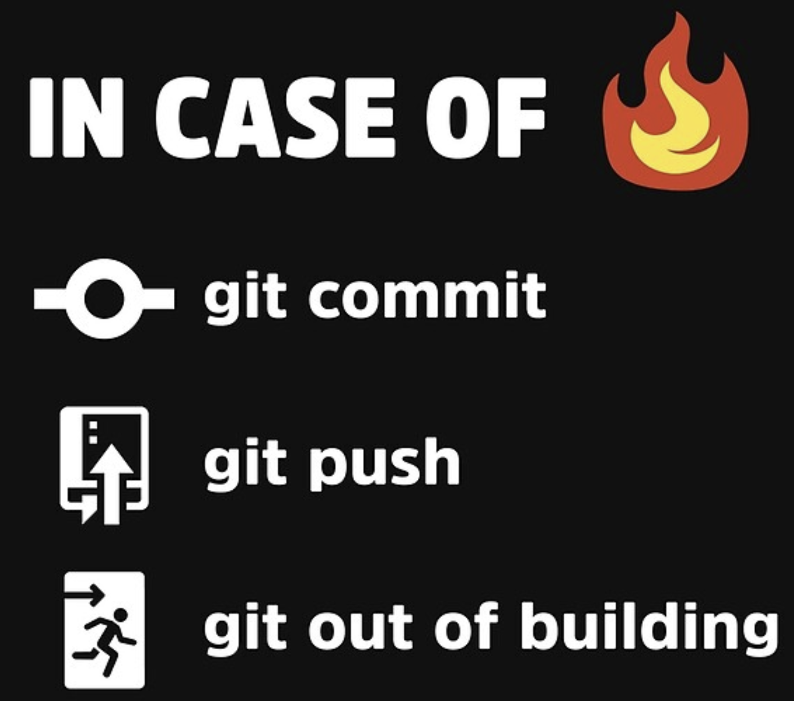

# Git & Github

## Class Objective:

The first week of class is meant to ensure everyone has completed any pre-work material, answer any questions, and in general make sure everyone is ready to hit the ground running in the second week. Below is the week's course material that is expected to be completed prior to class.

[Getting started with GitHub](https://app.pluralsight.com/library/courses/ff40abd2-2630-4c30-b1c0-d9f6498bb5fc) (\~1h 48min)

[Getting Started with Git](https://app.pluralsight.com/library/courses/getting-started-git/table-of-contents) (\~2h 03min)

If you have any questions prior to class, mentors are available via Slack. Don't hesitate to reach out, there are no stupid questions in the quest for growth. Please be respectful, and remember, we're all learning and helping each other.

## Prerequisites

It is expected that you have a computer with administrator access, and if you're on Windows you should have a bash shell installed. See [https://itsfoss.com/install-bash-on-windows/](https://itsfoss.com/install-bash-on-windows/) for various options.

## Workflow

The goal of this demo is to learn a basic git workflow using a personal repository on GitHub to save and share your project.

* Define a simple workflow for one person working on a project.
* Practice git commands for each step of the workflow.


Git cartoon from xkcd.com


It helps to start with an understanding of the overall workflow before digging into the specific git commands.



A simple git workflow can be broken down into two main phases: Project Setup and Project Development.&#x20;

In Project setup, you are creating a git repository and linking your computer to GitHub.

In Project Development, you are creating/updating the files in your project and syncing them with GitHub.



The process starts by creating a repository on github.com. Then you need to link the GitHub repo to your machine by either `git clone` or `git add origin`. Then you can work on the files in your repository on your local machine and sync them to git with `git push`.

In the next sections, we'll go through the commands in detail.

## Common Git Commands

What changes exist, and what is the state of git?

* Status: `git status`

Pull code down from a configured Git. Rebasing is helpful just prior to Pull Request submission as it pulls the remote changes and re-applies your changes on top for a clean commit tree.

* Pulling: `git pull`
* Pulling and rebase: `git pull --rebase`

Changes look good, add changes to the index

* Adding: `git add .`

All index changes look good, wrap into commit and stage the commit

* Committing: `git commit -m “message”`

Push the staged commit to the configured branch upstream repo

* Pushing: `git push`

`See detailed file changes`

* Diffing: `git diff`

## Part 1

1. Install git: [https://git-scm.com/downloads](https://git-scm.com/downloads)
2. (optional) GitHub command-line tool: [https://cli.github.com/](https://cli.github.com)
3. Setup GitHub **account** via: [https://github.com/join](https://github.com/join)
4. Create a new **repository** with the same name as your username using default options
5. Generate a **private key** pair: [https://docs.github.com/en/authentication/connecting-to-github-with-ssh/generating-a-new-ssh-key-and-adding-it-to-the-ssh-agent](https://docs.github.com/en/authentication/connecting-to-github-with-ssh/generating-a-new-ssh-key-and-adding-it-to-the-ssh-agent)
6. **Add** private key to GitHub account: [https://docs.github.com/en/authentication/connecting-to-github-with-ssh/adding-a-new-ssh-key-to-your-github-account](https://docs.github.com/en/authentication/connecting-to-github-with-ssh/adding-a-new-ssh-key-to-your-github-account)
7. Test **SSH connection** using private key: [https://docs.github.com/en/authentication/connecting-to-github-with-ssh/testing-your-ssh-connection](https://docs.github.com/en/authentication/connecting-to-github-with-ssh/testing-your-ssh-connection)
8. Initialize the repository in a **local** workspace

```bash
# create a workspace directory where all future projects will share
cd ~
mkdir workspace
cd workspace

# create a directory for the repo
mkdir $<myreponame>
cd $<myreponame>

# initialize the directory with git
git init

# create the README file and add some contents
echo "my-special-repo" >> README.md

# add the modified file to the git index
git add README.md

# wrap index files into a commit
git commit -m "Initializing my profile repo"

# move to the main branch aka create
git branch -M main

# tell git where the remote repo lives
# substitute username and reponame values before executing
git remote add origin git@github.com:username/reponame.git

# tell the git branch where its upstream repo lives
git branch --set-upstream-to=origin/main main

# push your changes from your local machine's staging area to the remote repository GitHub.com
# to the main branch
git push
```

7\. Replace the `username` and `reponame` values in the URL coming up, and browse to `http://github.com/username/reponame` to validate your changes were pushed. **Congratulations**, you've just pushed your first code change!

## Part 2

Let's give your GitHub account profile some style.

Now that you know how to modify files locally, and push them to a remote repo at GitHub you deserve to flex a bit. In this section, we are going to take advantage of a special kind of repo on GitHub called a `profile` repo that tells GitHub to display the **README.md** of the repo as a user profile object on the GitHub account profile page. Not sure what I'm talking about? Here are some pics:

Standard GitHub profile look. No hate Dorothy, you were completely random.

.png>)

One example of customization. Everything inside of the red box is read directly from the `README.md` that exists in the root of our repo that we just created.

.png>)

Below is the snippet of code used in the customized example. See if you can update your README.md with some sort of personalization. GL!

````
# AboutMe

```python
AboutMe = {
    Name: "Name",
    Languages: [
        "Python",
        "Solidity",
        "Typescript"
    ],
    Passions: [
        "Building things",
        "Blockchain Technologies",
    ]
}
```

### Social media links

[](My Discord Link) [](https://youtube.com/MyUserName/) [](https://twitter.com/MyUserName/) [](https://www.instagram.com/MyUserName/)

Crypto Donations accepted @ MyENSName.


````

If you've made it this far successfully, you are on your way to good things. Give me a follow if you fancy: [https://github.com/white8785](https://github.com/white8785)

## Wrapup

In this week's course, we learned...

1. How to create a GitHub account
2. How to create a private SSH key that will keep our connection secure
3. How to add that private SSH key to our GitHub account for access
4. How to initiate an existing GitHub repo via the command-line
5. How to push a file to GitHub
6. How to pimp out our GitHub account profile

This process and the experience gained from using git can benefit you in various ways and will be used in every position you run across. Practice, and get familiar. You will be here a lot during your career.

If nothing else, using git could save you from losing your work.



### Homework

* [ ] Setup a code editor of your choice to use going forward. A lot of folks like **VS Code** made by Microsoft, but there are plenty of options. Choose your favorite and get it setup fo next week's class.

Check back next week when we cover Core Python **Functions** and **Functional Programming**. **Variables**, **Data** **Types**, **Conditionals**, **Lists**, **Dictionaries**, **Loops**, **Files**, and **Modules**. Don't miss out!
